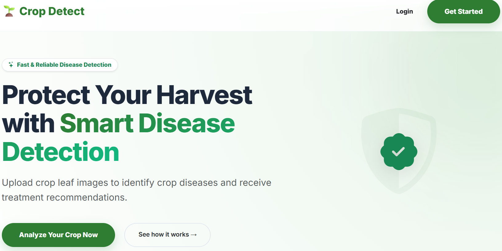
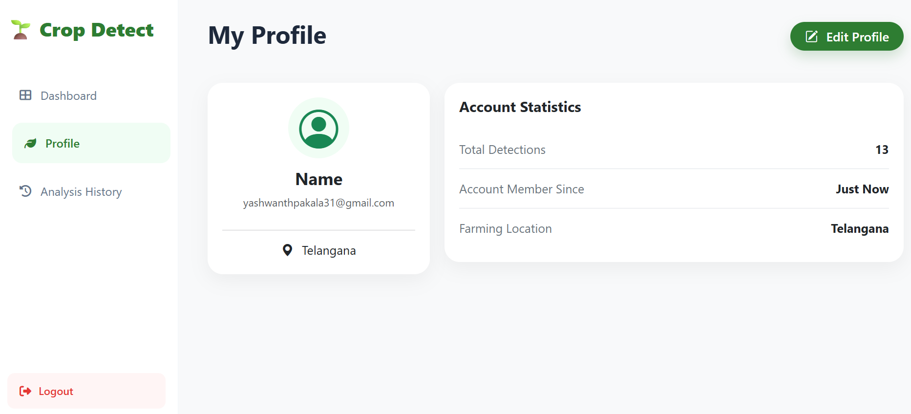
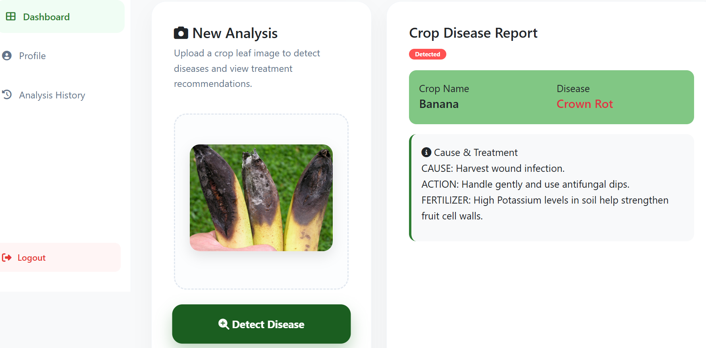

# 🌿 Crop Disease Detection System

A modern Flask-based web application that helps users identify crop diseases, manage prediction history, and receive disease information through a secure and user-friendly interface.

---

## 🌐 Live Demo

🚀 **Live Demo:** <https://ai-crop-disease-detection-69f9.onrender.com>

---

## 📖 Overview

Crop Disease Detection System is a Flask-based web application designed to simplify crop disease identification. Users can securely register, upload crop leaf images, view disease details, receive treatment recommendations, manage prediction history, and update their profiles through an intuitive dashboard.

---

## ✨ Features

- 🔐 User Authentication
- 👤 User Registration & Login
- 🔑 Forgot Password via Email OTP
- 🌿 Crop Disease Detection
- 📋 Disease Information & Report
- 💊 Treatment Recommendations
- 📜 Prediction History
- 👤 User Profile Management
- 🛠️ Admin Dashboard
- 📱 Responsive Design
- 💾 SQLite Database

---

## 🛠️ Tech Stack

### Frontend
- HTML5
- CSS3
- JavaScript
- Bootstrap 5

### Backend
- Python
- Flask

### Database
- SQLite

### Deployment
- Render

### Development Tools
- Visual Studio Code (VS Code)

---

## 📂 Project Structure

```text
Crop-Disease-Detection-System/
│
├── app.py
├── requirements.txt
├── crop_app.db
├── static/
├── templates/
├── model/
├── assets/
│   └── screenshots/
└── README.md
```

---

## 📸 Screenshots

| Home | Login |
|------|-------|
|  |  |

| Dashboard | Profile |
|-----------|---------|
|  |  |

| Disease Report |
|----------------|
|  |

---

## 📋 Workflow

1. Register a new account.
2. Login securely.
3. Upload a crop leaf image.
4. Detect crop disease.
5. View disease details and treatment recommendations.
6. Access prediction history.
7. Manage your profile.

---

## 🔒 Security Features

- Password Hashing
- Email OTP Verification
- Secure Session Management
- Protected Routes

---

## 📈 Future Enhancements

- Integrate a trained image classification model
- Support additional crop varieties
- Cloud database integration
- Mobile application
- Multi-language support

---

## 📄 License

This project is intended for educational and portfolio purposes.

---

## 👨‍💻 Developer

**Pakala Yashwanth**

🎓 B.Tech – Computer Engineering (Artificial Intelligence)

**GitHub:** <https://github.com/YASHWANTHPAKALA>

---

## ⭐ Support

If you found this project helpful, consider giving this repository a ⭐ on GitHub!
